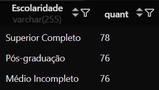
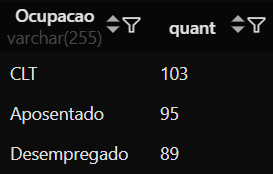
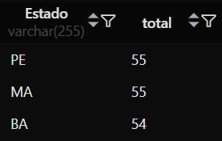
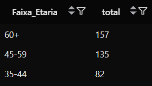
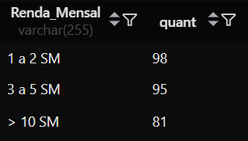
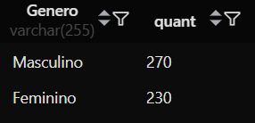

# Perfil Médio

Perfil médio do “cidadão brasileiro” com base nessa amostra. [Click aqui para ver a amostra](./socio_economico.sql)

#### Escolaridade:

```SQL
SELECT Escolaridade, COUNT(*) as quant
FROM socio_economico
GROUP BY Escolaridade
ORDER BY quant DESC
LIMIT 3;
```


#### Ocupação:

```SQL
SELECT Ocupacao, COUNT(*) as quant
FROM socio_economico
GROUP BY Ocupacao
ORDER BY quant DESC
LIMIT 3;
```


#### Estado:

```SQL
SELECT Estado, COUNT(*) AS quant
FROM socio_economico
GROUP BY Estado
ORDER BY quant DESC
LIMIT 3;
```


#### Faixa Etária:

```SQL
SELECT
  CASE
    WHEN Idade BETWEEN 18 AND 24 THEN '18-24'
    WHEN Idade BETWEEN 25 AND 34 THEN '25-34'
    WHEN Idade BETWEEN 35 AND 44 THEN '35-44'
    WHEN Idade BETWEEN 45 AND 59 THEN '45-59'
    ELSE '60+'
  END AS Faixa_Etaria,
  COUNT(*) AS quant
FROM socio_economico
GROUP BY Faixa_Etaria
ORDER BY quant DESC
LIMIT 3;
```


#### Faixa de Renda:

```SQL
SELECT Renda_Mensal, COUNT(*) as quant
FROM socio_economico
GROUP BY `Renda_Mensal`
ORDER BY quant DESC;
```


#### Gênero:

```SQL
SELECT Genero, COUNT(*) AS quant
FROM socio_economico
GROUP BY Genero
ORDER BY quant DESC
LIMIT 3;
```



## Com base na amostra da tabela socio_economico, o perfil médio do cidadão brasileiro é:

Uma pessoa do gênero **Masculino**, na faixa etária de **60+** anos, com escolaridade de **Superior Completo**, atuando como **CLT**, com uma renda mensal média entre **1 e 2 SM**, residente no estado de **Pernambuco**.